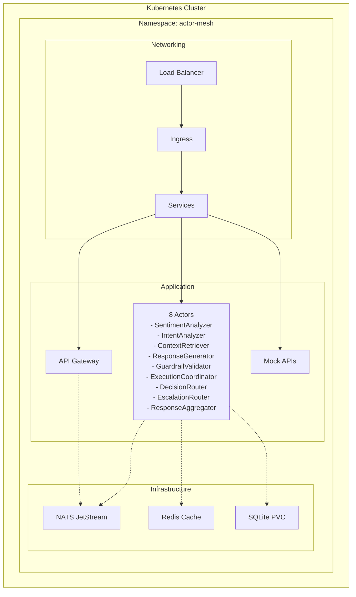

# Kubernetes Deployment Guide

## Overview

This guide provides comprehensive instructions for deploying the E-commerce Support Agent Actor Mesh Demo to Kubernetes environments, including local development with k3d and production deployments.

## Table of Contents

1. [Prerequisites](#prerequisites)
2. [Quick Start with k3d](#quick-start-with-k3d)
3. [Architecture Overview](#architecture-overview)
4. [Deployment Components](#deployment-components)
5. [Configuration](#configuration)
6. [Deployment Procedures](#deployment-procedures)
7. [Monitoring and Observability](#monitoring-and-observability)
8. [Troubleshooting](#troubleshooting)
9. [Production Considerations](#production-considerations)
10. [Scaling and Performance](#scaling-and-performance)

## Prerequisites

### Required Tools
- **Docker** (v20.10+)
- **kubectl** (v1.28+)
- **k3d** (v5.6+) for local development
- **Helm** (v3.13+) recommended
- **Git** for source code management

### Optional Tools
- **kustomize** (v5.0+) for configuration management
- **stern** for log aggregation
- **k9s** for cluster visualization
- **dive** for image analysis

### System Requirements
- **CPU**: 4+ cores (8+ recommended for production)
- **Memory**: 8GB+ RAM (16GB+ recommended for production)
- **Storage**: 20GB+ available disk space
- **Network**: Internet access for pulling images

## Quick Start with k3d

### 1. Setup Local Kubernetes Cluster

```bash
# Create k3d cluster with all components
./scripts/k3d-setup.sh

# Or step by step:
./scripts/k3d-setup.sh setup    # Create cluster and registry
./scripts/k3d-setup.sh build    # Build and push images
```

### 2. Deploy Application

```bash
# Build Docker images and deploy
./scripts/build-images.sh
./scripts/deploy.sh

# Or using Kustomize
kubectl apply -k k8s/overlays/development
```

### 3. Access the Application

```bash
# Add to /etc/hosts:
echo "127.0.0.1 actor-mesh.local api.actor-mesh.local chat.actor-mesh.local" | sudo tee -a /etc/hosts

# Access endpoints:
# - Main App: http://actor-mesh.local:8080
# - Chat Widget: http://actor-mesh.local:8080/widget
# - API Docs: http://actor-mesh.local:8080/docs
# - Health Check: http://actor-mesh.local:8080/api/health
```

## Architecture Overview

### Kubernetes Components



### Actor Mesh Components

| Component | Replicas | Resources | Description |
|-----------|----------|-----------|-------------|
| Gateway | 2-3 | 512Mi/500m | FastAPI HTTP/WebSocket gateway |
| SentimentAnalyzer | 1-2 | 128Mi/100m | Sentiment analysis processor |
| IntentAnalyzer | 1-2 | 256Mi/200m | LLM-based intent classification |
| ContextRetriever | 1-2 | 128Mi/100m | Multi-API data aggregation |
| ResponseGenerator | 1-2 | 256Mi/200m | LLM response generation |
| GuardrailValidator | 1-2 | 128Mi/100m | Safety and policy validation |
| ExecutionCoordinator | 1-2 | 128Mi/100m | Action execution |
| DecisionRouter | 1-2 | 128Mi/100m | Smart message routing |
| EscalationRouter | 1-2 | 128Mi/100m | Error handling and escalation |
| ResponseAggregator | 1-2 | 128Mi/100m | Response collection |
| MockServices | 1 | 256Mi/200m | Development APIs |

## Deployment Components

### Directory Structure

```
k8s/
├── base/                           # Base Kubernetes manifests
│   ├── namespace.yaml             # Actor-mesh namespace
│   ├── nats.yaml                  # NATS JetStream
│   ├── redis.yaml                 # Redis cache
│   ├── secrets.yaml               # Secret templates
│   ├── ingress.yaml               # Ingress controllers
│   └── kustomization.yaml         # Base kustomization
├── configmaps/
│   └── app-config.yaml            # Application configuration
├── deployments/
│   ├── gateway.yaml               # API Gateway deployment
│   ├── actors.yaml                # All actor deployments
│   └── mock-services.yaml         # Mock API services
└── overlays/
    ├── development/               # Development environment
    │   ├── kustomization.yaml
    │   └── patches/
    │       ├── gateway-dev.yaml
    │       └── resources-dev.yaml
    └── production/                # Production environment
        ├── kustomization.yaml
        └── patches/
            ├── gateway-prod.yaml
            ├── resources-prod.yaml
            ├── security-prod.yaml
            └── monitoring-prod.yaml
```

### Infrastructure Components

#### NATS JetStream
- **StatefulSet** with persistent storage
- **ConfigMap** for NATS configuration
- **Service** for client connections
- **Monitoring** endpoint on port 8222

#### Redis Cache
- **StatefulSet** with persistent storage
- **ConfigMap** for Redis configuration
- **Secret** for authentication
- **Service** for cache access

#### Persistent Storage
- **PVC** for SQLite database
- **PVC** for NATS data
- **PVC** for Redis data
- **EmptyDir** for logs and temporary files

## Configuration

### Environment Variables

#### Core Configuration
```yaml
# NATS Configuration
NATS_URL: "nats://nats:4222"

# Redis Configuration  
REDIS_URL: "redis://redis:6379"

# Database
SQLITE_DB_PATH: "/app/data/conversations.db"

# API Endpoints
CUSTOMER_API_URL: "http://mock-services:8001"
ORDERS_API_URL: "http://mock-services:8002"
TRACKING_API_URL: "http://mock-services:8003"
```

#### LLM Configuration
```yaml
# LLM Settings
LITELLM_MODEL: "gpt-3.5-turbo"
RESPONSE_TEMPERATURE: "0.3"
INTENT_TIMEOUT: "30"
USE_LLM_VALIDATION: "true"
```

#### Performance Settings
```yaml
# Performance
MAX_CONCURRENT_REQUESTS: "100"
REQUEST_TIMEOUT: "60"
ACTOR_POOL_SIZE: "5"
CACHE_TTL: "3600"
RATE_LIMIT_REQUESTS: "1000"
```

### Secrets Management

#### Development Secrets
```bash
# Create development secrets
kubectl create secret generic app-secrets \
  --namespace=actor-mesh \
  --from-literal=OPENAI_API_KEY="your-dev-key" \
  --from-literal=JWT_SECRET="dev-jwt-secret"
```

#### Production Secrets
```bash
# Create production secrets from files
kubectl create secret generic app-secrets \
  --namespace=actor-mesh \
  --from-file=secrets/openai-api-key.txt \
  --from-file=secrets/anthropic-api-key.txt \
  --from-file=secrets/jwt-secret.txt
```

## Deployment Procedures

### Development Deployment

#### 1. Build and Deploy
```bash
# Complete setup
./scripts/k3d-setup.sh setup
./scripts/build-images.sh
./scripts/deploy.sh

# Or using Kustomize
kubectl apply -k k8s/overlays/development
```

#### 2. Verify Deployment
```bash
# Check pod status
kubectl get pods -n actor-mesh

# Check services
kubectl get svc -n actor-mesh

# Check ingress
kubectl get ingress -n actor-mesh

# Check logs
kubectl logs -f deployment/gateway -n actor-mesh
```

#### 3. Port Forwarding (Alternative Access)
```bash
# Gateway
kubectl port-forward svc/gateway 8080:80 -n actor-mesh

# NATS monitoring
kubectl port-forward svc/nats 8222:8222 -n actor-mesh

# Redis
kubectl port-forward svc/redis 6379:6379 -n actor-mesh
```

### Production Deployment

#### 1. Pre-deployment Checklist
- [ ] Update image tags in `k8s/overlays/production/kustomization.yaml`
- [ ] Configure production secrets
- [ ] Set up external monitoring
- [ ] Configure backups
- [ ] Review resource limits
- [ ] Set up alerting

#### 2. Deploy Infrastructure First
```bash
# Deploy namespace and infrastructure
kubectl apply -f k8s/base/namespace.yaml
kubectl apply -f k8s/base/nats.yaml
kubectl apply -f k8s/base/redis.yaml

# Wait for infrastructure
kubectl wait --for=condition=ready pod -l app=nats -n actor-mesh --timeout=300s
kubectl wait --for=condition=ready pod -l app=redis -n actor-mesh --timeout=300s
```

#### 3. Deploy Application
```bash
# Build production images
REGISTRY_URL=your-registry.com TAG=v1.0.0 ./scripts/build-images.sh

# Deploy with production overlay
IMAGE_TAG=v1.0.0 ENVIRONMENT=production ./scripts/deploy.sh

# Or using Kustomize
kubectl apply -k k8s/overlays/production
```

#### 4. Rolling Updates
```bash
# Update image tag and deploy
kubectl set image deployment/gateway gateway=your-registry.com/actor-mesh:v1.0.1 -n actor-mesh

# Check rollout status
kubectl rollout status deployment/gateway -n actor-mesh

# Rollback if needed
kubectl rollout undo deployment/gateway -n actor-mesh
```

### Zero-Downtime Deployments

#### Using Blue-Green Strategy
```bash
# Deploy to staging namespace first
kubectl apply -k k8s/overlays/staging

# Test staging environment
./scripts/health-check.sh staging

# Switch traffic to new version
kubectl patch service gateway -n actor-mesh -p '{"spec":{"selector":{"version":"v1.0.1"}}}'
```

#### Using Canary Strategy
```bash
# Deploy canary version with reduced replicas
kubectl apply -f k8s/overlays/canary/

# Monitor metrics and gradually increase traffic
kubectl scale deployment gateway-canary --replicas=2 -n actor-mesh

# Complete rollout or rollback based on metrics
```

## Monitoring and Observability

### Health Checks

#### Kubernetes Health Checks
```yaml
livenessProbe:
  httpGet:
    path: /api/health
    port: 8000
  initialDelaySeconds: 30
  periodSeconds: 30

readinessProbe:
  httpGet:
    path: /api/health
    port: 8000
  initialDelaySeconds: 10
  periodSeconds: 10
```

#### Custom Health Checks
```bash
# Check all components
kubectl get pods -n actor-mesh -o wide

# Check specific component health
kubectl exec deployment/gateway -n actor-mesh -- curl http://localhost:8000/api/health

# Check NATS connectivity
kubectl exec deployment/gateway -n actor-mesh -- curl http://nats:8222/connz
```

### Logging

#### Centralized Logging Setup
```bash
# Install Fluent Bit (example)
helm repo add fluent https://fluent.github.io/helm-charts
helm install fluent-bit fluent/fluent-bit -n kube-system

# Or use built-in log aggregation
kubectl logs -f -l app=actor-mesh-demo -n actor-mesh --max-log-requests=20
```

#### Log Analysis
```bash
# View aggregated logs
stern -n actor-mesh actor-mesh-demo

# Filter by component
kubectl logs -f -l component=gateway -n actor-mesh

# Export logs for analysis
kubectl logs deployment/gateway -n actor-mesh --since=1h > gateway-logs.txt
```

### Metrics and Monitoring

#### Prometheus Setup
```yaml
# ServiceMonitor for Prometheus
apiVersion: monitoring.coreos.com/v1
kind: ServiceMonitor
metadata:
  name: actor-mesh-metrics
  namespace: actor-mesh
spec:
  selector:
    matchLabels:
      app: actor-mesh-demo
  endpoints:
  - port: http
    path: /metrics
```

#### Key Metrics to Monitor
- **Request Rate**: HTTP requests per second
- **Response Time**: P95/P99 latencies
- **Error Rate**: HTTP 4xx/5xx responses
- **Actor Processing Time**: Message processing latencies
- **NATS Metrics**: Message throughput and queue depth
- **Redis Metrics**: Cache hit rate and memory usage
- **Resource Usage**: CPU, memory, and disk utilization

### Alerting

#### Critical Alerts
```yaml
# Example PrometheusRule
apiVersion: monitoring.coreos.com/v1
kind: PrometheusRule
metadata:
  name: actor-mesh-alerts
spec:
  groups:
  - name: actor-mesh
    rules:
    - alert: HighErrorRate
      expr: rate(http_requests_total{status=~"5.."}[5m]) > 0.1
      labels:
        severity: critical
    - alert: HighResponseTime
      expr: histogram_quantile(0.95, rate(http_request_duration_seconds_bucket[5m])) > 1.0
      labels:
        severity: warning
```

## Troubleshooting

### Common Issues

#### 1. Pods Not Starting
```bash
# Check pod status
kubectl describe pod <pod-name> -n actor-mesh

# Check events
kubectl get events -n actor-mesh --sort-by=.metadata.creationTimestamp

# Check resource constraints
kubectl top pods -n actor-mesh
```

#### 2. Service Connection Issues
```bash
# Test service connectivity
kubectl exec -it deployment/gateway -n actor-mesh -- curl http://nats:4222

# Check service endpoints
kubectl get endpoints -n actor-mesh

# Verify DNS resolution
kubectl exec -it deployment/gateway -n actor-mesh -- nslookup nats.actor-mesh.svc.cluster.local
```

#### 3. Image Pull Issues
```bash
# Check image pull secrets
kubectl get secrets -n actor-mesh

# Verify image exists
docker pull localhost:5001/actor-mesh/actor-mesh-demo:latest

# Check registry connectivity
kubectl run debug --image=busybox -it --rm -- wget -O- http://localhost:5001/v2/
```

#### 4. Configuration Issues
```bash
# Check ConfigMaps
kubectl get configmap -n actor-mesh -o yaml

# Check Secrets
kubectl get secrets -n actor-mesh

# Verify environment variables
kubectl exec deployment/gateway -n actor-mesh -- env | grep -E "(NATS|REDIS|LLM)"
```

### Debugging Commands

```bash
# Interactive shell in pod
kubectl exec -it deployment/gateway -n actor-mesh -- /bin/bash

# Copy files from pod
kubectl cp actor-mesh/gateway-pod:/app/logs/app.log ./local-app.log

# Port forward for debugging
kubectl port-forward deployment/gateway 8080:8000 -n actor-mesh

# Scale deployment for debugging
kubectl scale deployment gateway --replicas=0 -n actor-mesh
kubectl scale deployment gateway --replicas=1 -n actor-mesh
```

### Performance Debugging

```bash
# Check resource usage
kubectl top pods -n actor-mesh
kubectl top nodes

# Analyze slow requests
kubectl logs -f deployment/gateway -n actor-mesh | grep "slow"

# Check NATS performance
kubectl port-forward svc/nats 8222:8222 -n actor-mesh
curl http://localhost:8222/varz | jq '.slow_consumers'
```

## Production Considerations

### Security

#### Pod Security Standards
```yaml
apiVersion: v1
kind: Pod
spec:
  securityContext:
    runAsNonRoot: true
    runAsUser: 1000
    fsGroup: 1000
    seccompProfile:
      type: RuntimeDefault
  containers:
  - name: app
    securityContext:
      allowPrivilegeEscalation: false
      readOnlyRootFilesystem: true
      capabilities:
        drop: ["ALL"]
```

#### Network Policies
```yaml
apiVersion: networking.k8s.io/v1
kind: NetworkPolicy
metadata:
  name: actor-mesh-network-policy
  namespace: actor-mesh
spec:
  podSelector:
    matchLabels:
      app: actor-mesh-demo
  policyTypes:
  - Ingress
  - Egress
  ingress:
  - from:
    - namespaceSelector:
        matchLabels:
          name: ingress-nginx
    ports:
    - protocol: TCP
      port: 8000
```

#### Secret Management
```bash
# Use external secret management
# Example with HashiCorp Vault
helm repo add hashicorp https://helm.releases.hashicorp.com
helm install vault hashicorp/vault

# Or use cloud provider secret management
# AWS Secrets Manager, Azure Key Vault, Google Secret Manager
```

### High Availability

#### Multi-Zone Deployment
```yaml
apiVersion: apps/v1
kind: Deployment
spec:
  template:
    spec:
      affinity:
        podAntiAffinity:
          preferredDuringSchedulingIgnoredDuringExecution:
          - weight: 100
            podAffinityTerm:
              labelSelector:
                matchExpressions:
                - key: component
                  operator: In
                  values: ["gateway"]
              topologyKey: topology.kubernetes.io/zone
```

#### Pod Disruption Budgets
```yaml
apiVersion: policy/v1
kind: PodDisruptionBudget
metadata:
  name: gateway-pdb
  namespace: actor-mesh
spec:
  minAvailable: 1
  selector:
    matchLabels:
      component: gateway
```

### Backup and Recovery

#### Database Backups
```bash
# Create backup job
kubectl create job backup-db-$(date +%Y%m%d-%H%M%S) \
  --from=cronjob/backup-db -n actor-mesh

# Restore from backup
kubectl exec -it deployment/response-aggregator -n actor-mesh -- \
  sqlite3 /app/data/conversations.db ".restore /backups/conversations-backup.db"
```

#### Configuration Backups
```bash
# Backup all manifests
kubectl get all,configmap,secret,pvc,ingress -n actor-mesh -o yaml > actor-mesh-backup.yaml

# Backup using Velero (example)
velero backup create actor-mesh-backup --include-namespaces actor-mesh
```

## Scaling and Performance

### Horizontal Pod Autoscaling

#### CPU-based Autoscaling
```yaml
apiVersion: autoscaling/v2
kind: HorizontalPodAutoscaler
metadata:
  name: gateway-hpa
  namespace: actor-mesh
spec:
  scaleTargetRef:
    apiVersion: apps/v1
    kind: Deployment
    name: gateway
  minReplicas: 2
  maxReplicas: 10
  metrics:
  - type: Resource
    resource:
      name: cpu
      target:
        type: Utilization
        averageUtilization: 70
```

#### Custom Metrics Autoscaling
```yaml
apiVersion: autoscaling/v2
kind: HorizontalPodAutoscaler
metadata:
  name: gateway-custom-hpa
  namespace: actor-mesh
spec:
  scaleTargetRef:
    apiVersion: apps/v1
    kind: Deployment
    name: gateway
  minReplicas: 2
  maxReplicas: 20
  metrics:
  - type: Pods
    pods:
      metric:
        name: http_requests_per_second
      target:
        type: AverageValue
        averageValue: "100"
```

### Vertical Pod Autoscaling

```yaml
apiVersion: autoscaling.k8s.io/v1
kind: VerticalPodAutoscaler
metadata:
  name: gateway-vpa
  namespace: actor-mesh
spec:
  targetRef:
    apiVersion: apps/v1
    kind: Deployment
    name: gateway
  updatePolicy:
    updateMode: "Auto"
  resourcePolicy:
    containerPolicies:
    - containerName: gateway
      maxAllowed:
        cpu: 2
        memory: 2Gi
      minAllowed:
        cpu: 100m
        memory: 256Mi
```

### Performance Optimization

#### Resource Tuning
```yaml
# Production resource configuration
resources:
  requests:
    memory: "512Mi"
    cpu: "200m"
  limits:
    memory: "1Gi"
    cpu: "1000m"
```

#### JVM Tuning (if applicable)
```yaml
env:
- name: JAVA_OPTS
  value: "-Xms512m -Xmx1g -XX:+UseG1GC -XX:MaxGCPauseMillis=200"
```

#### Connection Pooling
```yaml
env:
- name: CONNECTION_POOL_SIZE
  value: "20"
- name: MAX_CONNECTIONS
  value: "100"
- name: CONNECTION_TIMEOUT
  value: "30"
```

## Maintenance

### Cluster Maintenance

#### Kubernetes Upgrades
```bash
# Drain nodes before upgrade
kubectl drain <node-name> --ignore-daemonsets --delete-emptydir-data

# After upgrade, uncordon nodes
kubectl uncordon <node-name>
```

#### Component Updates
```bash
# Update NATS
kubectl set image statefulset/nats nats=nats:2.10.1-alpine -n actor-mesh

# Update Redis
kubectl set image statefulset/redis redis=redis:7.2-alpine -n actor-mesh
```

### Regular Maintenance Tasks

```bash
# Clean up completed jobs
kubectl delete job --field-selector status.successful=1 -n actor-mesh

# Rotate logs
kubectl exec deployment/gateway -n actor-mesh -- logrotate /app/logs/logrotate.conf

# Update certificates (if using cert-manager)
kubectl delete certificate --all -n actor-mesh
kubectl apply -f k8s/base/certificates.yaml
```

## Conclusion

This deployment guide provides comprehensive coverage of deploying and managing the Actor Mesh Demo in Kubernetes environments. For additional support:

- Check the [main README](README.md) for application-specific details
- Review [troubleshooting logs](logs/) for common issues
- Consult [API documentation](http://localhost:8080/docs) when running
- Monitor [GitHub issues](https://github.com/actormesh/actor-mesh-demo/issues) for updates

For production deployments, always perform thorough testing in staging environments and follow your organization's deployment and security policies.