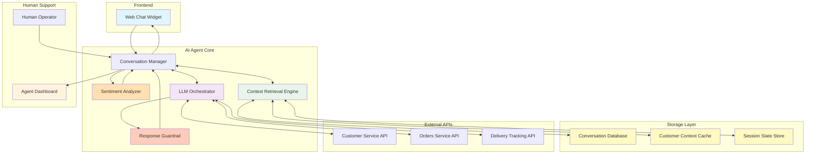
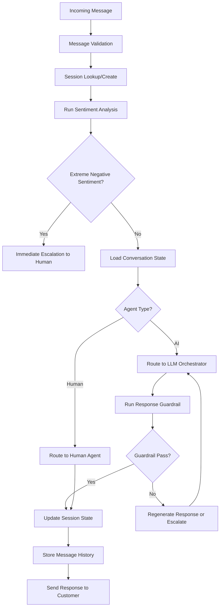
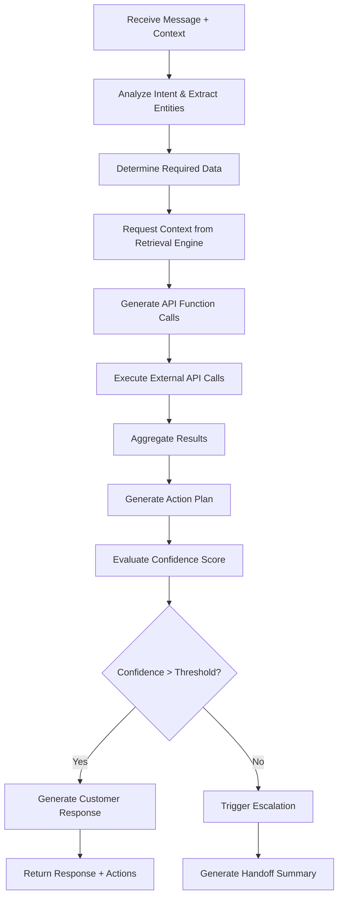
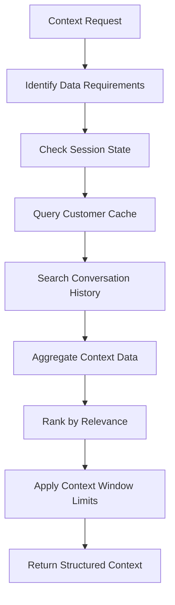
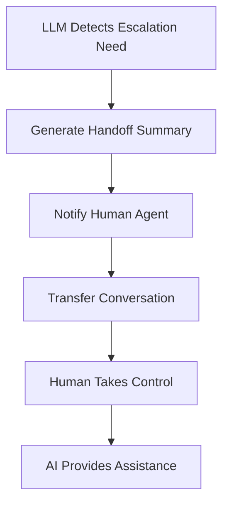
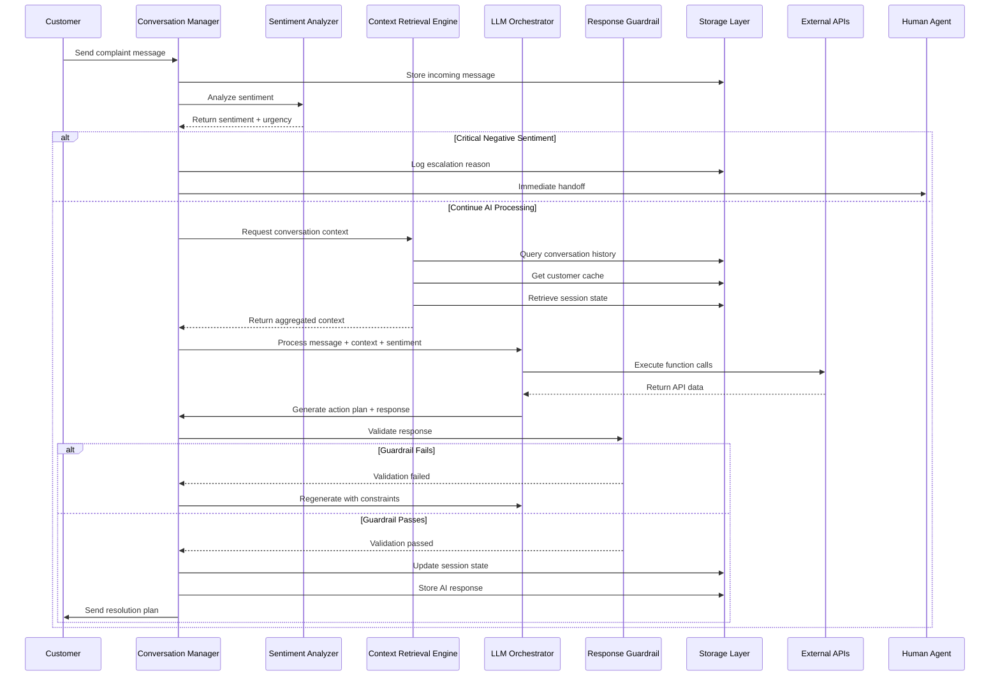

# E-commerce Support AI Agent - System Design

## System Overview

A conversational AI agent that handles customer complaints through a web chat interface, integrating with existing e-commerce APIs and using LLMs for all decision-making processes.

## System Architecture



## Core Components

### 1. Web Chat Widget
- Real-time messaging interface
- Conversation history display
- Typing indicators and status updates
- File attachment support (screenshots, receipts)

### 2. Sentiment Analyzer (Pre-LLM Filter)
- **Fast Sentiment Classification**: Analyzes customer message sentiment in real-time
- **Urgency Detection**: Identifies high-priority or escalating situations
- **Emotion Tagging**: Detects frustration, anger, satisfaction levels
- **Early Escalation Trigger**: Flags extremely negative sentiment for immediate human routing
- **Context Enrichment**: Adds sentiment metadata to conversation context

### 3. Conversation Manager
- **Message Routing**: Routes incoming/outgoing messages between customer and AI/human agents
- **State Management**: Tracks conversation state (active, escalated, closed)
- **Session Control**: Manages conversation sessions and timeouts
- **Agent Handoff**: Orchestrates seamless transfers between AI and human agents
- **Message History**: Maintains chronological message order and threading

### 3. Conversation Manager
- **Message Routing**: Routes incoming/outgoing messages between customer and AI/human agents
- **State Management**: Tracks conversation state (active, escalated, closed)
- **Session Control**: Manages conversation sessions and timeouts
- **Agent Handoff**: Orchestrates seamless transfers between AI and human agents
- **Message History**: Maintains chronological message order and threading

### 4. LLM Orchestrator
- **Prompt Engineering**: Constructs specialized prompts for different AI tasks
- **Function Calling**: Executes API calls based on LLM-generated function calls
- **Response Processing**: Parses LLM outputs and extracts actionable items
- **Context Injection**: Incorporates relevant context into LLM prompts
- **Confidence Scoring**: Evaluates LLM response quality and escalation needs

### 4. Context Retrieval Engine
- **Data Aggregation**: Gathers relevant context from multiple storage sources
- **Context Ranking**: Prioritizes most relevant information for current conversation
- **Cache Management**: Optimizes data retrieval with intelligent caching
- **Context Synthesis**: Combines stored data with real-time API responses
- **Memory Management**: Handles context window limits and information pruning

### 5. Storage Layer

#### Conversation Database (PostgreSQL)
- **Message History**: Complete conversation transcripts with timestamps
- **Conversation Metadata**: Session info, participant details, resolution status
- **Escalation Logs**: Handoff reasons, resolution attempts, outcomes

#### Customer Context Cache (Redis)
- **Recent Interactions**: Last 30 days of customer conversations
- **Customer Profile**: Tier, preferences, frequently referenced orders
- **Active Sessions**: Current conversation state and temporary variables

#### Session State Store (In-Memory)
- **Current Variables**: Extracted entities, order IDs, tracking numbers
- **Conversation Flow**: Current step in resolution process
- **Pending Actions**: Queued API calls and follow-up tasks

## PoC Implementation Approaches

### Sentiment Analyzer Implementation

#### Option 1: Lightweight Pre-trained Model (Recommended for PoC)
```python
# Use DistilBERT or similar small model fine-tuned for sentiment
from transformers import pipeline

sentiment_analyzer = pipeline(
    "sentiment-analysis",
    model="distilbert-base-uncased-finetuned-sst-2-english"
)

def analyze_sentiment(message):
    result = sentiment_analyzer(message)[0]
    return {
        "sentiment": result["label"],  # POSITIVE, NEGATIVE, NEUTRAL
        "confidence": result["score"],
        "urgency": calculate_urgency(result)
    }

def calculate_urgency(sentiment_result):
    if sentiment_result["label"] == "NEGATIVE" and sentiment_result["score"] > 0.9:
        return "high"
    elif sentiment_result["label"] == "NEGATIVE":
        return "medium"
    return "low"
```

**Pros for PoC:**
- Fast inference (~50ms)
- Can run locally or on small instance
- No API costs
- Easy to integrate

**Cons:**
- Limited accuracy compared to larger models
- May miss nuanced emotions

#### Option 2: Rule-Based + Small Model Hybrid
```python
# Combine keyword matching with ML for better accuracy
URGENCY_KEYWORDS = {
    "high": ["urgent", "immediately", "asap", "terrible", "worst", "fraud"],
    "escalation": ["lawyer", "complaint", "refund", "cancel", "unacceptable"]
}

def analyze_sentiment_hybrid(message):
    # Quick keyword check first
    message_lower = message.lower()
    for keyword in URGENCY_KEYWORDS["escalation"]:
        if keyword in message_lower:
            return {"sentiment": "NEGATIVE", "confidence": 0.95, "urgency": "critical"}
    
    # Then run ML model
    ml_result = sentiment_analyzer(message)[0]
    
    # Combine insights
    urgency = "high" if any(kw in message_lower for kw in URGENCY_KEYWORDS["high"]) else "medium"
    
    return {
        "sentiment": ml_result["label"],
        "confidence": ml_result["score"],
        "urgency": urgency
    }
```

**Pros for PoC:**
- Very fast with keyword pre-filtering
- High accuracy for critical cases
- Low cost

#### Option 3: API-Based Service (Alternative)
```python
# Use third-party sentiment API for quick setup
import requests

def analyze_sentiment_api(message):
    # Example: Google Cloud Natural Language API
    response = requests.post(
        "https://language.googleapis.com/v1/documents:analyzeSentiment",
        json={"document": {"content": message, "type": "PLAIN_TEXT"}}
    )
    return response.json()
```

**Pros:** Zero setup, highly accurate  
**Cons:** API costs, latency, external dependency

---

### Response Guardrail Implementation

#### Option 1: LLM-as-Judge (Recommended for PoC)
```python
# Use the same LLM or smaller one to validate responses
async def check_response_guardrail(response, context):
    guardrail_prompt = f"""
You are a response safety validator for customer support. Evaluate this response:

Response: "{response}"
Context: Customer issue is about {context["issue_type"]}

Check for:
1. Is the response professional and empathetic?
2. Does it contain any promises we can't keep?
3. Are there any policy violations?
4. Is there any PII or sensitive data exposed?
5. Does it make sense given the context?

Respond with JSON:
{{"safe": true/false, "reason": "explanation", "severity": "low/medium/high"}}
"""
    
    result = await llm.generate(guardrail_prompt)
    guardrail_check = parse_json(result)
    
    if not guardrail_check["safe"]:
        if guardrail_check["severity"] == "high":
            # Escalate to human
            return {"pass": False, "action": "escalate"}
        else:
            # Regenerate with additional constraints
            return {"pass": False, "action": "regenerate"}
    
    return {"pass": True}
```

**Pros for PoC:**
- Flexible and comprehensive
- Easy to add new checks
- Good accuracy

**Cons:**
- Additional LLM call adds latency (~1-2s)
- Extra API costs

#### Option 2: Rule-Based Checklist (Fast for PoC)
```python
import re

def check_response_guardrail(response, context):
    checks = {
        "profanity": check_profanity(response),
        "promises": check_unauthorized_promises(response),
        "pii": check_pii_exposure(response),
        "policy": check_policy_compliance(response, context),
        "coherence": check_coherence(response, context)
    }
    
    failed_checks = [k for k, v in checks.items() if not v["pass"]]
    
    if failed_checks:
        severity = max([checks[k]["severity"] for k in failed_checks])
        return {
            "pass": False,
            "failed_checks": failed_checks,
            "severity": severity,
            "action": "escalate" if severity == "high" else "regenerate"
        }
    
    return {"pass": True}

def check_unauthorized_promises(response):
    # Check for commitments AI shouldn't make
    unauthorized_patterns = [
        r"guarantee.*refund",
        r"will definitely.*\$\d+",
        r"promise.*free",
        r"can cancel.*immediately"
    ]
    
    for pattern in unauthorized_patterns:
        if re.search(pattern, response.lower()):
            return {"pass": False, "severity": "high"}
    
    return {"pass": True, "severity": "low"}

def check_pii_exposure(response):
    # Check for exposed credit card, SSN, etc.
    pii_patterns = [
        r"\b\d{4}[- ]?\d{4}[- ]?\d{4}[- ]?\d{4}\b",  # Credit card
        r"\b\d{3}-\d{2}-\d{4}\b"  # SSN
    ]
    
    for pattern in pii_patterns:
        if re.search(pattern, response):
            return {"pass": False, "severity": "high"}
    
    return {"pass": True, "severity": "low"}
```

**Pros for PoC:**
- Very fast (<10ms)
- No additional API costs
- Deterministic and debuggable

**Cons:**
- Limited to predefined rules
- May miss edge cases

#### Option 3: Hybrid Approach (Best Balance)
```python
async def check_response_guardrail_hybrid(response, context):
    # Step 1: Fast rule-based checks for critical issues
    quick_checks = run_rule_based_checks(response, context)
    
    if not quick_checks["pass"] and quick_checks["severity"] == "high":
        # Immediate rejection for critical issues
        return {"pass": False, "action": "escalate", "reason": quick_checks["reason"]}
    
    # Step 2: LLM validation for nuanced issues
    if quick_checks["needs_llm_review"]:
        llm_check = await run_llm_guardrail(response, context)
        if not llm_check["safe"]:
            return {"pass": False, "action": llm_check["action"]}
    
    return {"pass": True}
```

**Pros:** Fast for common cases, thorough for complex ones  
**Cons:** Slightly more complex implementation

---

### Recommended PoC Setup

**For Sentiment Analyzer:**
- Start with **Option 2 (Hybrid)**: Keywords for critical cases + DistilBERT for general sentiment
- Implementation time: ~2-3 hours
- Inference time: ~50-100ms
- Cost: Free (local model)

**For Response Guardrail:**
- Start with **Option 3 (Hybrid)**: Rule-based for critical checks + LLM for edge cases
- Implementation time: ~4-5 hours
- Validation time: ~100ms (rules only) or ~1-2s (with LLM)
- Cost: Minimal (only LLM calls for ~20% of responses)

### Integration Timeline for PoC
1. **Day 1**: Implement sentiment analyzer with hybrid approach
2. **Day 2**: Add rule-based guardrail checks
3. **Day 3**: Integrate LLM-based guardrail for edge cases
4. **Day 4**: Test and tune thresholds
5. **Day 5**: Deploy and monitor

## Detailed Component Architecture

### Conversation Manager Workflow


### LLM Orchestrator Process Flow


### Context Retrieval Engine Workflow


## LLM Processing Phases

### Phase 1: Understanding & Information Gathering
```
Customer Message → LLM Analysis → API Data Retrieval → Context Building
```

**LLM Tasks:**
- Extract intent, entities, and sentiment from customer message
- Identify required information (customer ID, order numbers, etc.)
- Generate API queries to gather relevant data
- Summarize findings and assess situation

### Phase 2: Decision Making & Planning
```
Complete Context → LLM Planning → Action Plan → Customer Confirmation
```

**LLM Tasks:**
- Analyze all available information
- Determine appropriate resolution strategy
- Generate step-by-step action plan
- Assess confidence level and escalation need
- Create customer-facing explanation

### Phase 3: Execution & Follow-up
```
Approved Plan → LLM Execution → API Calls → Status Updates → Case Closure
```

**LLM Tasks:**
- Execute approved actions through API calls
- Generate confirmation messages
- Create follow-up tasks if needed
- Summarize resolution for case records

## Example Flow: Delayed Order Complaint

### Step 1: Customer Input
```
Customer: "My order #12345 was supposed to arrive yesterday but I haven't received it!"
```

### Step 2: LLM Analysis & Data Gathering
```
LLM Prompt: "Analyze this customer complaint and extract key information..."

LLM Response:
- Intent: delivery_complaint
- Order: #12345
- Issue: delayed_delivery
- Sentiment: frustrated
- Required data: customer info, order details, tracking status
```

### Step 2: Context Retrieval & Data Gathering
```python
# Context Retrieval Engine aggregates:
context = {
    "conversation_history": get_recent_messages(session_id, limit=10),
    "customer_profile": get_customer_cache(customer_email),
    "session_variables": get_session_state(session_id),
    "previous_issues": get_customer_support_history(customer_id, days=30)
}

# LLM Orchestrator requests external data:
api_data = {
    "customer": customer_service_api.get_customer(customer_email),
    "order": orders_service_api.get_order("12345"),
    "tracking": delivery_tracking_api.get_status(tracking_number)
}
```

### Step 3: LLM Analysis & Planning
```python
# LLM Orchestrator constructs comprehensive prompt:
llm_prompt = f"""
Context: {context}
Customer Message: "My order #12345 was supposed to arrive yesterday but I haven't received it!"
External Data: {api_data}

Analyze the situation and create a resolution plan. Consider:
1. Customer tier and history
2. Order details and delivery status  
3. Previous similar issues and resolutions
4. Appropriate compensation or actions

Format response as JSON with: intent, entities, action_plan, confidence_score
"""

llm_response = {
    "intent": "delivery_complaint",
    "entities": {"order_number": "12345", "expected_delivery": "yesterday"},
    "action_plan": [
        {"action": "expedite_delivery", "api_call": "delivery_tracking.expedite()"},
        {"action": "sms_updates", "api_call": "customer_service.enable_notifications()"},
        {"action": "shipping_credit", "api_call": "customer_service.add_credit()"}
    ],
    "confidence_score": 0.87,
    "escalation_needed": false
}
```

### Step 4: Response Generation & Execution
```python
# LLM generates customer-facing response
customer_response = llm.generate_response({
    "action_plan": llm_response["action_plan"],
    "customer_context": context["customer_profile"],
    "tone": "empathetic_professional"
})

# LLM Orchestrator executes approved actions
for action in approved_actions:
    if action["action"] == "expedite_delivery":
        delivery_tracking_api.expedite(tracking_number="1Z123456")
    elif action["action"] == "sms_updates":
        customer_service_api.enable_sms_updates(customer_id, tracking_number)
    elif action["action"] == "shipping_credit":
        customer_service_api.add_shipping_credit(customer_id)

# Update storage layers
session_state.update({"last_action": "delivery_expedited", "resolution_attempted": True})
conversation_db.store_message(session_id, "agent", customer_response)
customer_cache.update_recent_interaction(customer_id, {"issue": "delivery_delay", "resolved": True})
```

## Escalation Logic

### LLM-Based Escalation Decision
The LLM evaluates multiple factors to determine escalation:

```
LLM Prompt: "Should this case be escalated to a human agent? Consider:
- Customer sentiment and language
- Complexity of the issue
- Previous resolution attempts
- Customer value and history
- Potential legal/safety implications"
```

### Escalation Triggers
- Customer explicitly requests human agent
- Customer requests refund or return
- LLM confidence score below threshold
- Multiple failed resolution attempts
- High-value customer with complex issue
- Potential legal or safety concerns

### Handoff Process


## Human Agent Integration

### Agent Dashboard Features
- Live conversation queue
- Customer context and history
- AI-generated case summaries
- Suggested actions from LLM analysis
- One-click handoff back to AI

### AI Assistant Mode
When human agents are active:
- LLM provides real-time suggestions
- Auto-generates response drafts
- Looks up relevant information
- Handles routine tasks in background

## Data Flow with Storage Integration



## Technology Stack

### Core Components
- **Frontend**: React-based chat widget
- **Backend**: Node.js/Python API server
- **LLM**: OpenAI GPT-4 or Anthropic Claude
- **Database**: PostgreSQL for conversation history
- **Real-time**: WebSocket connections

### External Integrations
- **APIs**: REST clients for Customer, Orders, and Delivery services
- **Chat**: WebSocket for real-time messaging
- **LLM**: OpenAI/Anthropic API integration

This simplified design focuses on using a single LLM for all AI tasks while maintaining clear separation of concerns and enabling seamless human-AI collaboration.