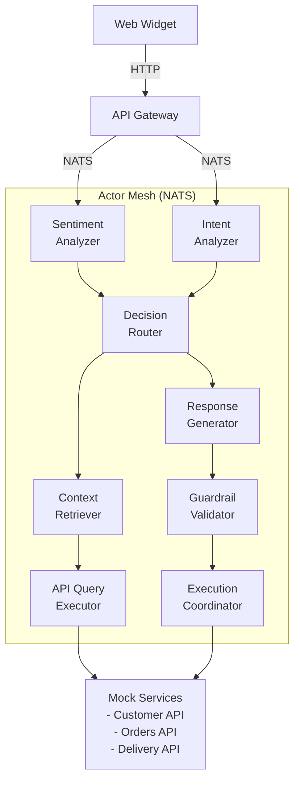

# E-commerce Support AI Agent - Actor Mesh Demo Application Specification

## 1. System Overview

This demo implements an AI-powered customer support agent for e-commerce complaints using Actor Mesh architecture. The system runs entirely on a local development machine, demonstrating key Actor Mesh principles: distributed actors communicating via NATS message queues, choreography-based sagas with smart routers, and content enrichment patterns.

## 2. Architecture Design

### 2.1 System Topology



### 2.2 Actor Types

**Processors (Naive):**
- **SentimentAnalyzer**: Classifies message sentiment (positive/negative/neutral) and urgency
- **IntentAnalyzer**: Extracts intent and entities from customer message using LLM
- **ContextRetriever**: Fetches customer, order, and delivery data from mock APIs
- **ResponseGenerator**: Uses LLM to generate customer-facing responses
- **GuardrailValidator**: Validates responses for safety and policy compliance
- **ExecutionCoordinator**: Executes approved actions via mock APIs

**Routers (Smart):**
- **DecisionRouter**: Routes based on sentiment, intent, and confidence scores
- **EscalationRouter**: Handles failures and escalations

**Entry/Exit Points:**
- **APIGateway**: HTTP endpoint for web widget, converts to NATS messages
- **ResponseAggregator**: Collects processed messages and returns to web widget

## 3. Technology Stack

### 3.1 Core Components

| Component | Technology | Purpose |
|-----------|-----------|---------|
| Container Orchestration | k3d (k3s in Docker) | Local Kubernetes cluster |
| Message Queue | NATS JetStream | Actor communication and message persistence |
| Backend Language | Python 3.11+ | Actor implementation |
| Web Framework | FastAPI | API Gateway HTTP endpoint |
| Frontend | HTML/JS (Vanilla) | Minimal chat widget |
| Context Store | Redis | Session state and customer cache |
| Conversation Store | SQLite | Message history persistence |
| LLM Client | LiteLLM | Unified interface for GPT/Gemini/Anthropic/Ollama |
| Actor Framework | Custom (asyncio-based) | Lightweight actor implementation |

### 3.2 Python Dependencies

```
fastapi==0.104.1
uvicorn==0.24.0
nats-py==2.6.0
redis==5.0.1
aiosqlite==0.19.0
litellm==1.17.0
pydantic==2.5.0
httpx==0.25.2
```

## 4. Message Protocol

### 4.1 Message Structure

```python
class Message:
    message_id: str          # Unique identifier
    session_id: str          # Conversation session
    route: Route             # Routing information
    payload: MessagePayload  # Content (enriched)
    metadata: dict           # Timestamps, retries, etc.

class Route:
    steps: list[str]         # Actor mailbox addresses
    current_step: int        # Current position
    error_handler: str       # Error recovery actor

class MessagePayload:
    # Original input (immutable)
    customer_message: str
    customer_email: str

    # Enrichments (appended by actors)
    sentiment: dict | None
    intent: dict | None
    context: dict | None
    api_data: dict | None
    action_plan: dict | None
    response: str | None
    guardrail_check: dict | None
    execution_result: dict | None

    # Error tracking
    error: dict | None
    recovery_log: list[dict]
```

### 4.2 NATS Subject Structure

```
ecommerce.support.{actor_name}
```

Examples:
- `ecommerce.support.sentiment_analyzer`
- `ecommerce.support.intent_analyzer`
- `ecommerce.support.decision_router`

### 4.3 Standard Routes

**Happy Path:**
```python
["sentiment_analyzer", "intent_analyzer", "context_retriever",
 "decision_router", "response_generator", "guardrail_validator",
 "response_aggregator"]
```

**With Action Execution:**
```python
["sentiment_analyzer", "intent_analyzer", "context_retriever",
 "decision_router", "response_generator", "guardrail_validator",
 "execution_coordinator", "response_aggregator"]
```

**Escalation Path:**
```python
["escalation_router", "response_aggregator"]
```

## 5. Component Specifications

### 5.1 API Gateway

**Responsibilities:**
- Accept HTTP requests from web widget
- Create initial message with default route
- Publish to NATS
- Wait for response from `response_aggregator` subject
- Return HTTP response

**Endpoints:**
```
POST /api/chat
{
  "session_id": "uuid",
  "customer_email": "user@example.com",
  "message": "My order is late!"
}

Response:
{
  "message_id": "uuid",
  "response": "I understand your order is delayed...",
  "action_plan": {...},
  "status": "resolved" | "escalated"
}
```

### 5.2 Sentiment Analyzer (Processor)

**Input:** Customer message
**Output:** Sentiment classification + urgency score
**Implementation:** Rule-based keywords + small model (if available)

```python
def analyze(payload):
    message = payload.customer_message.lower()

    # Quick keyword check
    critical_keywords = ["fraud", "lawyer", "terrible", "worst"]
    if any(kw in message for kw in critical_keywords):
        return {
            "sentiment": "NEGATIVE",
            "confidence": 0.95,
            "urgency": "critical"
        }

    # Fallback to basic sentiment
    negative_words = ["late", "delayed", "wrong", "missing", "broken"]
    score = sum(1 for word in negative_words if word in message)

    return {
        "sentiment": "NEGATIVE" if score > 0 else "NEUTRAL",
        "confidence": 0.7,
        "urgency": "high" if score >= 2 else "medium"
    }
```

### 5.3 Intent Analyzer (Processor)

**Input:** Customer message
**Output:** Intent classification + extracted entities
**Implementation:** LLM with structured prompt

```python
async def analyze_intent(payload, llm_client):
    prompt = f"""Analyze this customer support message and extract:
1. Intent (delivery_complaint, refund_request, product_issue, etc.)
2. Entities (order_number, product_name, etc.)

Message: "{payload.customer_message}"

Respond in JSON format:
{{"intent": "...", "entities": {{}}, "confidence": 0.0-1.0}}
"""

    response = await llm_client.complete(prompt)
    return parse_json(response)
```

### 5.4 Context Retriever (Processor)

**Input:** Extracted entities
**Output:** Customer data, order data, tracking data
**Implementation:** Parallel API calls to mock services

```python
async def retrieve_context(payload):
    customer_email = payload.customer_email
    order_number = payload.intent.get("entities", {}).get("order_number")

    # Parallel API calls
    customer_data = await mock_customer_api.get(customer_email)
    order_data = await mock_orders_api.get(order_number) if order_number else None
    tracking_data = await mock_tracking_api.get(order_data.tracking_id) if order_data else None

    return {
        "customer": customer_data,
        "order": order_data,
        "tracking": tracking_data
    }
```

### 5.5 Decision Router (Smart Router)

**Input:** Enriched message with sentiment, intent, context
**Output:** Modified route based on decision logic
**Implementation:** Rule-based decision tree

```python
def route_decision(msg):
    sentiment = msg.payload.sentiment
    intent = msg.payload.intent

    # Critical escalation
    if sentiment.get("urgency") == "critical":
        msg.route.steps = ["escalation_router", "response_aggregator"]
        msg.route.current_step = 0
        return msg

    # Refund requests need execution
    if intent.get("intent") == "refund_request":
        insert_after_current(msg, ["execution_coordinator"])

    # Low confidence needs human review
    if intent.get("confidence", 1.0) < 0.6:
        insert_after_current(msg, ["escalation_router"])

    return msg
```

### 5.6 Response Generator (Processor)

**Input:** Full enriched context
**Output:** Customer-facing response text
**Implementation:** LLM with comprehensive prompt

```python
async def generate_response(payload, llm_client):
    prompt = f"""You are a helpful customer support agent. Generate a professional response.

Customer Message: {payload.customer_message}
Intent: {payload.intent}
Customer Info: {payload.context.customer}
Order Info: {payload.context.order}
Tracking: {payload.context.tracking}

Create an empathetic response that:
1. Acknowledges the issue
2. Explains the current status
3. Proposes next steps
"""

    response = await llm_client.complete(prompt)
    return {"text": response}
```

### 5.7 Guardrail Validator (Processor)

**Input:** Generated response
**Output:** Validation result (pass/fail + reason)
**Implementation:** Rule-based checks

```python
def validate_guardrails(payload):
    response = payload.response.get("text", "")

    # Check for unauthorized promises
    bad_patterns = [
        r"guarantee.*refund",
        r"will definitely.*\$\d+",
        r"promise.*free"
    ]

    for pattern in bad_patterns:
        if re.search(pattern, response.lower()):
            return {
                "pass": False,
                "reason": "Unauthorized promise detected",
                "action": "regenerate"
            }

    return {"pass": True}
```

### 5.8 Mock Service APIs

**Implementation:** Simple in-memory data stores

```python
# Mock Customer Service API
CUSTOMERS = {
    "user@example.com": {
        "id": "cust_001",
        "name": "John Doe",
        "tier": "premium",
        "email": "user@example.com"
    }
}

# Mock Orders Service API
ORDERS = {
    "12345": {
        "order_id": "12345",
        "customer_id": "cust_001",
        "items": [...],
        "status": "shipped",
        "tracking_id": "1Z999AA10123456784"
    }
}

# Mock Tracking Service API
TRACKING = {
    "1Z999AA10123456784": {
        "status": "in_transit",
        "location": "Distribution Center",
        "expected_delivery": "2025-10-02"
    }
}
```

## 6. Storage Design

### 6.1 Redis (Session State)

```python
# Key structure
session:{session_id}:state = {
    "last_message_id": "...",
    "last_activity": "2025-09-30T10:00:00Z",
    "status": "active" | "escalated" | "resolved"
}

session:{session_id}:context = {
    "customer_email": "...",
    "customer_id": "...",
    "recent_orders": [...]
}
```

### 6.2 SQLite (Conversation History)

```sql
CREATE TABLE messages (
    message_id TEXT PRIMARY KEY,
    session_id TEXT NOT NULL,
    timestamp TEXT NOT NULL,
    sender TEXT NOT NULL, -- 'customer' | 'agent'
    content TEXT NOT NULL,
    route_trace TEXT, -- JSON array of steps taken
    payload TEXT -- Full enriched payload as JSON
);

CREATE INDEX idx_session ON messages(session_id, timestamp);
```

## 7. Implementation Plan

### Phase 1: Foundation (Days 1-2)

**Step 1.1: Project Setup**
- Initialize Python project with virtual environment
- Create `requirements.txt` with dependencies
- Set up project structure:
  ```
  actor-mesh-demo/
  ├── actors/
  │   ├── base.py
  │   ├── sentiment_analyzer.py
  │   ├── intent_analyzer.py
  │   ├── context_retriever.py
  │   ├── decision_router.py
  │   ├── response_generator.py
  │   ├── guardrail_validator.py
  │   └── response_aggregator.py
  ├── api/
  │   └── gateway.py
  ├── mock_services/
  │   ├── customer_api.py
  │   ├── orders_api.py
  │   └── tracking_api.py
  ├── models/
  │   └── message.py
  ├── storage/
  │   ├── redis_client.py
  │   └── sqlite_client.py
  ├── k8s/
  │   ├── deployments/
  │   └── configmaps/
  └── web/
      └── widget.html
  ```

**Step 1.2: Core Message Protocol**
- Implement `Message`, `Route`, `MessagePayload` Pydantic models
- Create message serialization/deserialization utilities
- Add route manipulation helpers

**Step 1.3: Base Actor Framework**
```python
class BaseActor:
    def __init__(self, name: str, nats_url: str):
        self.name = name
        self.subject = f"ecommerce.support.{name}"

    async def start(self):
        self.nc = await nats.connect(nats_url)
        self.js = self.nc.jetstream()
        await self.js.subscribe(self.subject, cb=self.handle_message)

    async def handle_message(self, msg):
        # Deserialize message
        # Process via self.process()
        # Route to next step
        # Handle errors

    async def process(self, payload: MessagePayload) -> dict:
        raise NotImplementedError

    async def send_to_next(self, message: Message):
        next_step = message.route.steps[message.route.current_step + 1]
        message.route.current_step += 1
        await self.js.publish(f"ecommerce.support.{next_step}",
                             message.json().encode())
```

### Phase 2: Mock Services & Storage (Day 3)

**Step 2.1: Mock APIs**
- Implement in-memory mock data stores
- Create FastAPI endpoints for Customer, Orders, Tracking APIs
- Add sample data for testing

**Step 2.2: Storage Layer**
- Set up Redis connection and session management
- Create SQLite database and schema
- Implement storage client classes

### Phase 3: Processor Actors (Days 4-5)

**Step 3.1: Sentiment Analyzer**
- Implement rule-based sentiment classification
- Add urgency detection logic
- Test with sample messages

**Step 3.2: Intent Analyzer**
- Integrate LiteLLM client
- Create intent analysis prompt
- Implement entity extraction

**Step 3.3: Context Retriever**
- Implement parallel API calls to mock services
- Handle missing data gracefully
- Test data aggregation

**Step 3.4: Response Generator**
- Create response generation prompts
- Integrate with LLM
- Test various scenarios

**Step 3.5: Guardrail Validator**
- Implement rule-based validation
- Add policy checks
- Test edge cases

### Phase 4: Router Actors (Day 6)

**Step 4.1: Decision Router**
- Implement decision tree logic
- Add route modification helpers
- Test various routing scenarios

**Step 4.2: Escalation Router**
- Implement escalation logic
- Add human handoff placeholder
- Test escalation triggers

### Phase 5: Entry/Exit Points (Day 7)

**Step 5.1: API Gateway**
- Create FastAPI application
- Implement `/api/chat` endpoint
- Add request/response correlation
- Implement timeout handling

**Step 5.2: Response Aggregator**
- Subscribe to response messages
- Correlate with pending HTTP requests
- Return formatted responses

### Phase 6: Web Widget (Day 8)

**Step 6.1: Basic Chat UI**
```html
<!DOCTYPE html>
<html>
<head>
    <title>Support Chat</title>
    <style>
        #chat-container { /* minimal styling */ }
    </style>
</head>
<body>
    <div id="chat-container">
        <div id="messages"></div>
        <input id="message-input" type="text" />
        <button onclick="sendMessage()">Send</button>
    </div>
    <script>
        async function sendMessage() {
            const message = document.getElementById('message-input').value;
            const response = await fetch('/api/chat', {
                method: 'POST',
                headers: {'Content-Type': 'application/json'},
                body: JSON.stringify({
                    session_id: getSessionId(),
                    customer_email: 'demo@example.com',
                    message: message
                })
            });
            const data = await response.json();
            displayMessage('Agent', data.response);
        }
    </script>
</body>
</html>
```

### Phase 7: Kubernetes Deployment (Days 9-10)

**Step 7.1: k3d Setup**
```bash
# Install k3d
curl -s https://raw.githubusercontent.com/k3d-io/k3d/main/install.sh | bash

# Create cluster
k3d cluster create support-agent --agents 2

# Verify
kubectl cluster-info
```

**Step 7.2: NATS Deployment**
```yaml
# k8s/nats-deployment.yaml
apiVersion: apps/v1
kind: Deployment
metadata:
  name: nats
spec:
  replicas: 1
  selector:
    matchLabels:
      app: nats
  template:
    metadata:
      labels:
        app: nats
    spec:
      containers:
      - name: nats
        image: nats:2.10-alpine
        args: ["-js", "-m", "8222"]
        ports:
        - containerPort: 4222
        - containerPort: 8222
---
apiVersion: v1
kind: Service
metadata:
  name: nats
spec:
  ports:
  - port: 4222
    name: client
  - port: 8222
    name: monitoring
  selector:
    app: nats
```

**Step 7.3: Redis & SQLite**
- Deploy Redis as StatefulSet
- Mount SQLite volume for persistence

**Step 7.4: Actor Deployments**
```yaml
# k8s/deployments/sentiment-analyzer.yaml
apiVersion: apps/v1
kind: Deployment
metadata:
  name: sentiment-analyzer
spec:
  replicas: 2
  selector:
    matchLabels:
      app: sentiment-analyzer
  template:
    metadata:
      labels:
        app: sentiment-analyzer
    spec:
      containers:
      - name: actor
        image: support-agent:latest
        command: ["python", "-m", "actors.sentiment_analyzer"]
        env:
        - name: NATS_URL
          value: "nats://nats:4222"
```

**Step 7.5: API Gateway Deployment**
- Deploy as Kubernetes Service (LoadBalancer)
- Configure ingress for web widget

### Phase 8: Testing & Refinement (Days 11-12)

**Step 8.1: Integration Testing**
- Test end-to-end message flow
- Verify all actor interactions
- Test error scenarios

**Step 8.2: Performance Testing**
- Test with multiple concurrent sessions
- Verify autoscaling (if implemented)
- Check message queue behavior

**Step 8.3: Documentation**
- Add README with setup instructions
- Document architecture decisions
- Create troubleshooting guide

## 8. Running the Demo

### 8.1 Prerequisites
```bash
# Install required tools
brew install k3d kubectl docker

# Install Python dependencies
pip install -r requirements.txt
```

### 8.2 Local Development Mode
```bash
# Start NATS locally
docker run -p 4222:4222 -p 8222:8222 nats:2.10-alpine -js

# Start Redis
docker run -p 6379:6379 redis:7-alpine

# Start mock services
python -m mock_services.customer_api &
python -m mock_services.orders_api &
python -m mock_services.tracking_api &

# Start actors
python -m actors.sentiment_analyzer &
python -m actors.intent_analyzer &
# ... etc for all actors

# Start API gateway
uvicorn api.gateway:app --reload

# Open web widget
open http://localhost:8000/widget.html
```

### 8.3 Kubernetes Mode
```bash
# Create k3d cluster
k3d cluster create support-agent

# Build and load image
docker build -t support-agent:latest .
k3d image import support-agent:latest -c support-agent

# Deploy
kubectl apply -f k8s/

# Access web widget
kubectl port-forward svc/api-gateway 8000:8000
open http://localhost:8000/widget.html
```

## 9. Success Criteria

The demo is successful if:
1. A customer can send a complaint via web widget
2. The message flows through all actors via NATS
3. Context is retrieved from mock APIs
4. LLM generates appropriate response
5. Response is returned to customer within 10 seconds
6. Message history is stored in SQLite
7. Session state is maintained in Redis
8. Critical sentiment triggers escalation path
9. System runs stable on local k3d cluster
10. Code is readable and well-documented
